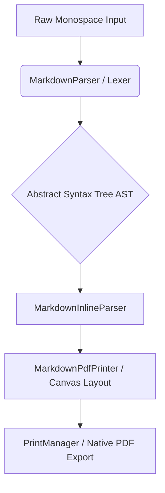

# PurplePrint

PurplePrint is an offline-first Android Markdown editor and PDF exporter. It lets you write Markdown, preview the rendered document, and export it through Android's native print pipeline without sending your content to a server.

## Highlights

* **Markdown editor and live preview:** Compose Markdown in a focused editor and preview the rendered output immediately.
* **Responsive layouts:** Uses a split editor/preview workspace on tablets and a tabbed workflow on phones.
* **Native PDF export:** Generates print-ready documents through Android `PrintManager` and `PdfDocument`.
* **Private by design:** No internet permission, no cloud conversion, no AI service dependency, and Android backup is disabled.
* **Material 3 interface:** A polished high-contrast interface with dark/light theme support.

## Screenshots

Screenshots can be added here after capturing the app from Android Studio or an emulator.

```md


```

## Requirements

* Android Studio
* JDK 11 or newer
* Android SDK Platform 36
* Gradle wrapper included in this repository

## Build

Open the project folder in Android Studio and let Gradle sync. You can also build from the terminal:

```powershell
.\gradlew.bat :app:assembleDebug
```

The debug APK is generated at:

```text
app/build/outputs/apk/debug/app-debug.apk
```

To build an unsigned release APK:

```powershell
.\gradlew.bat :app:assembleRelease
```

The unsigned release APK is generated at:

```text
app/build/outputs/apk/release/app-release-unsigned.apk
```

## Release Signing

The project does not store signing keys in source control. To create a signed release, provide these environment variables before running the release build:

```powershell
$env:KEYSTORE_PATH="C:\path\to\your-release-key.jks"
$env:STORE_PASSWORD="your-store-password"
$env:KEY_ALIAS="your-key-alias"
$env:KEY_PASSWORD="your-key-password"
.\gradlew.bat :app:assembleRelease
```

Keep keystores, passwords, and generated APK/AAB files out of Git. GitHub Releases are the right place to upload finished APK files.

## How It Works

PurplePrint's document pipeline has three main stages:



### Markdown Parsing

When the user edits the document, `MarkdownParser.kt` processes the raw string line by line:

* It classifies structural elements (Headings, Paragraphs, List Items, Block Quotes, Code Blocks, and Horizontal Rules).
* It generates an AST list of `MarkdownBlock` items.
* `MarkdownInlineParser.kt` extracts inline styling such as bold, italic, and inline code spans.

### PDF Layout

`MarkdownPrintAdapter` converts parsed Markdown into printable rows, measures content with Android `Paint`, wraps text to the selected paper size, and paginates rows before rendering.

* **Page Bounds Detection:** Retrieves page metrics (A4, Letter, Legal) selected by the user in the print dialog.
* **Word-by-Word Line Wrapping:** Measures words using the device's screen `Paint` configuration (`PdfPaints`) and wraps them if they exceed the usable canvas width.
* **Dynamic Pagination:** Groups headings, paragraphs, lists, quotes, code blocks, and rules across pages.

### Native Rendering

Once pages are mapped, the Android Print Spooler invokes `onWrite()`:

* A native `PdfDocument` is created.
* Each page is rendered onto a `Canvas`.
* The finished PDF is written to Android's print destination for saving, sharing, or physical printing.

## Testing

Run the local unit and Robolectric tests with:

```powershell
.\gradlew.bat :app:testDebugUnitTest
```

Run Android lint with:

```powershell
.\gradlew.bat :app:lintDebug
```

## Privacy And Security

PurplePrint is designed for local document processing:

* The manifest does not request internet access.
* Android cloud backup is disabled.
* No API keys, AI services, or remote PDF conversion services are required.
* Release signing credentials are read from environment variables and are not committed.

## Project Structure

```text
app/src/main/java/com/example/
  MainActivity.kt                  Main Compose UI
  markdown/MarkdownParser.kt       Block-level Markdown parser
  markdown/MarkdownInlineParser.kt Inline Markdown styling parser
  pdf/MarkdownPdfPrinter.kt        Native PDF layout and print adapter
  ui/theme/                        Material 3 theme
```

## License

Add a license file before publishing publicly if you want others to reuse or modify this project under clear terms.
