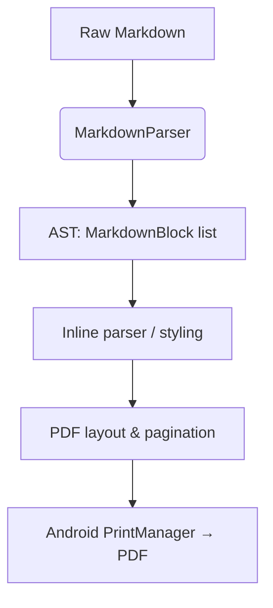

# 🟣 PurplePrint

[](https://developer.android.com)
[](https://kotlinlang.org)
[](https://developer.android.com/jetpack/compose)
[](https://m3.material.io)
[](https://gradle.org)
[](LICENSE)

**PurplePrint** is an offline-first Android Markdown editor and PDF exporter. Write Markdown, preview the rendered document, and export it through Android's native print pipeline – **without ever sending your content to a server**.

---

## ✨ Features

| Feature | Description |
|---------|-------------|
| ✍️ **Markdown editor + live preview** | Compose in a focused editor, see rendered output instantly. |
| 📱 **Responsive layouts** | Split editor/preview on tablets, tabbed workflow on phones. |
| 📄 **Native PDF export** | Print‑ready documents via `PrintManager` and `PdfDocument`. |
| 🔒 **Private by design** | No internet permission, no cloud conversion, no AI dependency. Android backup disabled. |
| 🎨 **Material 3 interface** | Polished, high‑contrast UI with dark/light theme support. |

---

## 📸 Screenshots

| Editor | Preview | PDF Export |
|--------|---------|-------------|
|  |  |  |

> *Additional screenshot:* 

---

## 🧰 Requirements

- [Android Studio](https://developer.android.com/studio) (Ladybug or newer)
- JDK 11 or newer
- Android SDK Platform 36
- Gradle wrapper (included)

---

## 🛠️ Build from Source

### 1. Clone the repository
```bash
git clone https://github.com/YOUR_USERNAME/purpleprint.git
cd purpleprint
```

### 2. Build a debug APK
```powershell
.\gradlew.bat :app:assembleDebug
```
The debug APK will be at:  
`app/build/outputs/apk/debug/app-debug.apk`

### 3. Build an unsigned release APK
```powershell
.\gradlew.bat :app:assembleRelease
```
The unsigned APK will be at:  
`app/build/outputs/apk/release/app-release-unsigned.apk`

> **Note:** For a signed release APK, you need a keystore. See [Release Signing](#-release-signing).

---

## 🔐 Release Signing

The project **does not store signing keys** in source control. To create a signed release, set the following environment variables before running `assembleRelease`:

```powershell
$env:KEYSTORE_PATH="C:\path\to\your-release-key.jks"
$env:STORE_PASSWORD="your-store-password"
$env:KEY_ALIAS="your-key-alias"
$env:KEY_PASSWORD="your-key-password"
.\gradlew.bat :app:assembleRelease
```

- Keep your keystore and passwords **private** (never commit them).
- Upload only the final signed APK to **GitHub Releases**.

---

## ⚙️ How It Works

The document pipeline consists of three stages:



### 1. Markdown Parsing
- `MarkdownParser.kt` processes the raw string line by line, classifying structural elements (headings, paragraphs, lists, block quotes, code blocks, horizontal rules).
- An AST list of `MarkdownBlock` items is generated.
- `MarkdownInlineParser.kt` extracts inline styling: **bold**, *italic*, `code spans`.

### 2. PDF Layout
`MarkdownPrintAdapter` converts parsed Markdown into printable rows:
- **Page bounds detection** – A4, Letter, Legal (user‑selected).
- **Word‑by‑word line wrapping** – uses `Paint` metrics.
- **Dynamic pagination** – groups content across pages.

### 3. Native Rendering
- Android Print Spooler calls `onWrite()`.
- A native `PdfDocument` is created.
- Each page is rendered onto a `Canvas`.
- The finished PDF is written to the print destination (save, share, or print).

---

## 🧪 Testing

Run unit tests (including Robolectric):
```powershell
.\gradlew.bat :app:testDebugUnitTest
```

Run Android lint:
```powershell
.\gradlew.bat :app:lintDebug
```

---

## 🔒 Privacy & Security

| Aspect | Implementation |
|--------|----------------|
| Internet access | ❌ Not requested in manifest |
| Cloud backup | ❌ Disabled for the app |
| Third‑party APIs | ❌ No API keys, AI services, or remote PDF conversion |
| Signing credentials | ✅ Read from environment variables (never committed) |

All document processing stays **100% on‑device**.

---

## 📁 Project Structure

```
purpleprint/
├── app/
│   ├── src/
│   │   ├── main/
│   │   │   ├── java/com/example/purpleprint/
│   │   │   │   ├── MainActivity.kt               # Compose UI entry point
│   │   │   │   ├── markdown/
│   │   │   │   │   ├── MarkdownParser.kt         # Block‑level parser
│   │   │   │   │   └── MarkdownInlineParser.kt   # Inline styling
│   │   │   │   ├── pdf/
│   │   │   │   │   └── MarkdownPdfPrinter.kt     # PDF layout & print adapter
│   │   │   │   ├── ui/
│   │   │   │   │   ├── theme/                    # Material 3 theme
│   │   │   │   │   └── screens/                  # Editor, preview, export screens
│   │   │   │   └── utils/                        # Helpers (optional)
│   │   │   └── res/                              # Resources (drawables, strings, etc.)
│   │   └── test/                                 # Unit tests
│   ├── build.gradle.kts                          # App‑level build config
│   └── proguard-rules.pro
├── gradle/                                       # Gradle wrapper files
├── build.gradle.kts                              # Project‑level build config
├── settings.gradle.kts
├── gradlew
├── gradlew.bat
└── README.md
```

> The actual structure may vary; this reflects the main logical components.

---

## 📄 License

This project is licensed under the **Apache License 2.0** – see the [LICENSE](LICENSE) file for details.

---

## 🙌 Contributing

Contributions are welcome! Please open an issue or pull request for any improvements, bug fixes, or features.

1. Fork the repository
2. Create your feature branch (`git checkout -b feature/amazing-feature`)
3. Commit your changes (`git commit -m 'Add amazing feature'`)
4. Push to the branch (`git push origin feature/amazing-feature`)
5. Open a Pull Request

---

## 📬 Contact

Project maintainer: [@guuly05](https://github.com/guuly05)  
Report issues: [GitHub Issues](https://github.com/guuly05/purpleprint/issues)

---
